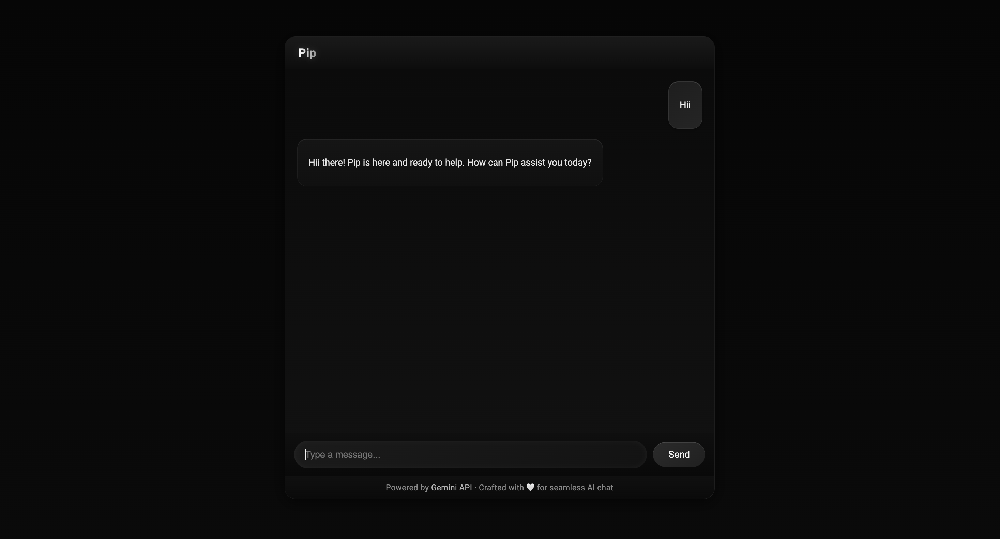

# Pip Chatbot — Flask + Google Gemini

Pip is an chatbot built using **Flask** and **Google’s Gemini API** (`gemini-2.5-flash` model).  
It features a clean web UI, persistent chat history per user session, and an option to clear memory anytime.

---

## Features

- **Web-based chat interface** — no CLI required
- **Black-themed professional UI**
- **Contextual conversation memory** (stored per user session)
- **Session-based memory clearing** with `/clear` endpoint
- **Powered by Google’s Gemini model (`gemini-2.5-flash`)**
- **Lightweight Flask backend**

---

## Technologies Used

- Backend - Flask
- AI Model - Google Gemini (gemini-2.5-flash)
- Session Storage - Flask-Session (filesystem)
- Frontend - HTML, CSS, JS

---

## Setup Instructions

1. Clone the repository
   `git clone https://github.com/Madhumidha-S/Pip-Chatbot`
2. Create and activate a virtual environment
   `python3 -m venv venv`
   `source venv/bin/activate  # On Windows: venv\Scripts\activate`
3. Install dependencies
   `pip install flask flask-session google-generativeai`
4. Create `.env` file and add your Gemini API key
5. Run the app
   `python app.py`
6. Open browser and visit `http://127.0.0.1:5000/`

---

## UI Preview

